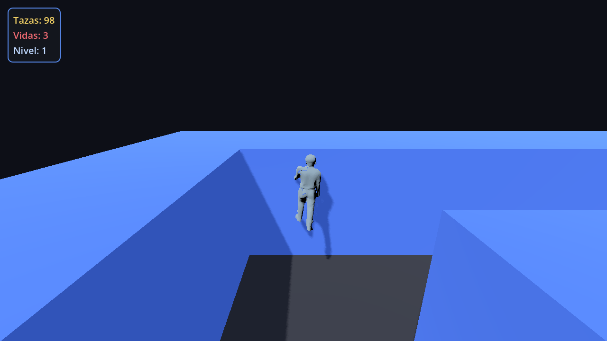
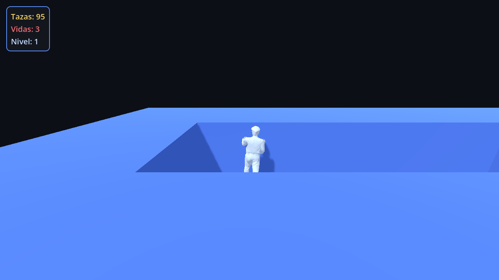

# Ancleto's Adventure

Juego estilo **Pacman en 3ª persona 3D**: Ancleto recorre laberintos generados
proceduralmente recogiendo **tazas de café** mientras esquiva enemigos que lo
persiguen. Hecho en **Godot 4.7**.



---

## Qué es

- **Vista 3ª persona 3D** con *mouse look* y movimiento relativo a la cámara.
- **Laberintos procedurales** (recursive backtracker + braid) con conectividad
  garantizada por *flood-fill*.
- **Objetivo**: recoger todas las tazas de café → nuevo mapa (nivel +1).
- **Enemigos** con IA de persecución (navmesh horneado en runtime) → contacto
  quita una vida (invulnerabilidad temporal).
- **3 variantes de Ancleto** seleccionables, riggeadas y animadas.
- **HUD** (tazas · vidas · nivel), Game Over y reinicio.

| Variante 1 | Variante 2 |
|---|---|
|  |  |

---

## Controles

| Acción | Tecla |
|---|---|
| Mover | `W` `A` `S` `D` / flechas |
| Cámara | Mouse (yaw/pitch) |
| Liberar mouse | `Esc` |
| Elegir variante | `←` `→` |
| Confirmar / reiniciar | `Enter` / `Espacio` |

---

## Requisitos

- **Godot 4.7** (`godot --version`). Renderer Forward+ (probado con Vulkan en
  AMD RX 6600).

## Ejecutar

```bash
# Desde el proyecto
godot --path .

# O abre la carpeta en el editor de Godot y pulsa F5
```

## Exportar (un binario por sistema operativo)

Los presets están en `export_presets.cfg` y el pipeline en `tools/export_all.sh`.

```bash
# Todos los presets
tools/export_all.sh

# Selectivo
tools/export_all.sh "Linux" "Windows Desktop"
```

Salida en `build/<os>/`. Requisitos de export templates: se instalan en
`~/.local/share/godot/export_templates/4.7.2.stable/`.

| SO | ¿Se construye en Linux? | Notas |
|---|---|---|
| Linux | ✅ | `.x86_64` + `.pck` |
| Windows | ✅ | `.exe` + `.pck` |
| macOS | ✅ | `.zip` (firma ad-hoc) |
| Web | ✅ | `.html` + `.wasm` + `.pck` |
| Android | ⚠️ | requiere Android SDK + JDK |
| iOS | ⚠️ | requiere macOS + Xcode |

También hay CI en `.github/workflows/export.yml` (Linux/Windows/macOS/Web).

---

## Estructura del proyecto

```
res://
├── project.godot
├── export_presets.cfg          # presets de exportación (6 SO)
├── scenes/
│   ├── Main.tscn               # máquina de estados de pantalla
│   ├── CharacterSelect.tscn    # selección de las 3 variantes
│   ├── GameOver.tscn
│   ├── World.tscn              # nivel jugable
│   ├── HUD.tscn
│   ├── player/Player.tscn      # CharacterBody3D + cámara 3ª persona
│   ├── enemies/Enemy.tscn
│   └── pickups/CoffeeCup.tscn
├── scripts/
│   ├── game_manager.gd         # autoload: vidas, nivel, tazas, variante
│   ├── maze_generator.gd       # generación + validación de laberintos
│   ├── maze_config.gd
│   ├── model_util.gd           # normalización de escala de modelos
│   ├── rig_pose.gd             # locomoción procedural (idle/caminar)
│   ├── player.gd · enemy.gd · coffee_cup.gd · world.gd
│   ├── hud.gd · character_select.gd · game_over.gd · main.gd
├── resources/maze_config.tres
├── assets/
│   ├── models/                 # Ancleto1/2/3 (riggeados) + coffee_cup + enemy
│   │   └── source/             # mallas originales sin rig
│   ├── CREDITS.md
├── tools/                      # tests headless + pipeline de export
│   ├── test_maze.gd · TestWorld · TestGameplay · TestFlow
│   ├── export_all.sh
│   └── ShotWorld · RigView
└── aspec/changes/ancleto-adventure-mvp/   # artefactos (propuesta/diseño/tasks/specs)
```

## Arquitectura

- **`GameManager`** (autoload) centraliza el estado (vidas, nivel, tazas,
  variante) y emite señales; las escenas reaccionan.
- **`MazeGenerator`**: rejilla impar → *recursive backtracker* → *braid* →
  validación por *flood-fill* (reintenta con otra semilla si falla).
- **`World`**: construye piso/muros (celdas de 3 u), coloca tazas y enemigos,
  hornea el `NavigationRegion3D` y arma el HUD.
- **`Player`**: `CharacterBody3D` con cámara `CameraPivot → SpringArm3D →
  Camera3D`, movimiento relativo a la cámara y animación procedural.
- **`Enemy`**: persigue con `NavigationAgent3D` (fallback a *steering* si no hay
  navmesh); `Area3D` de daño.

## Rigging

Los 3 modelos de Ancleto son mallas estáticas. Se riggearon **offline** con
[skin-tokens.cpp](https://github.com/localai-org/skin-tokens.cpp) (28 huesos c/u)
y la locomoción (idle/caminar) es **procedural** (`scripts/rig_pose.gd`),
rotando los huesos de piernas/brazos según el estado de movimiento.

## Assets y créditos

Todos los assets externos son **CC0** — ver [`assets/CREDITS.md`](assets/CREDITS.md).
Muros, piso y UI se generan proceduralmente en el motor.

## Desarrollo (spec-driven)

El trabajo está documentado como un *change* en
[`aspec/changes/ancleto-adventure-mvp/`](aspec/changes/ancleto-adventure-mvp/)
(propuesta, diseño, tareas y specs).

## Estado

MVP completo: gameplay, procedural, enemigos, 3 variantes riggeadas/animadas,
HUD, selección, pipeline de exportación.
